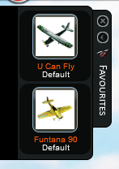
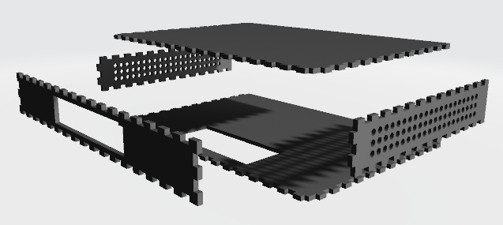
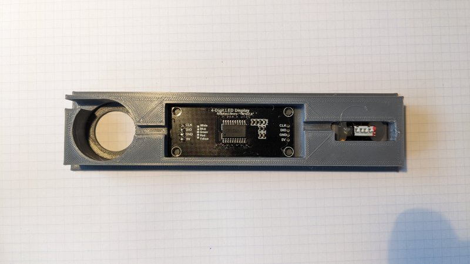
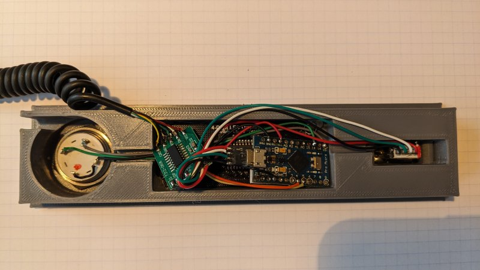
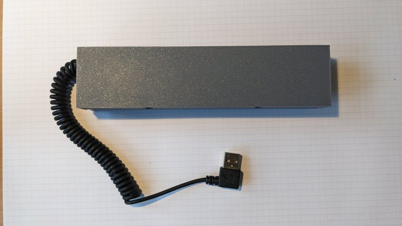
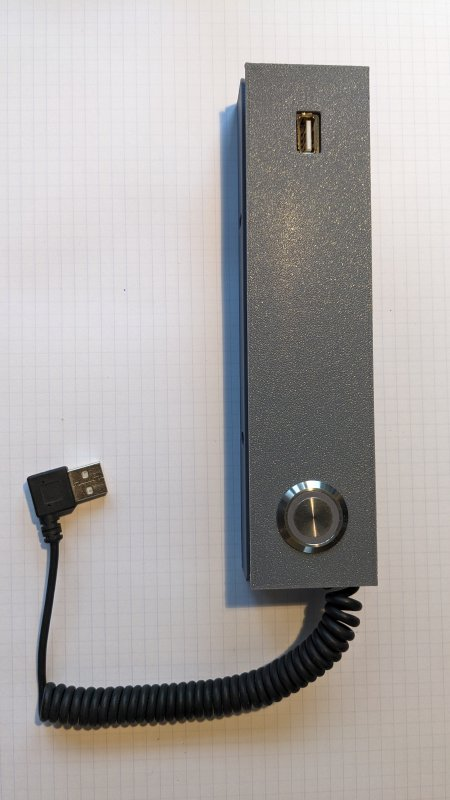
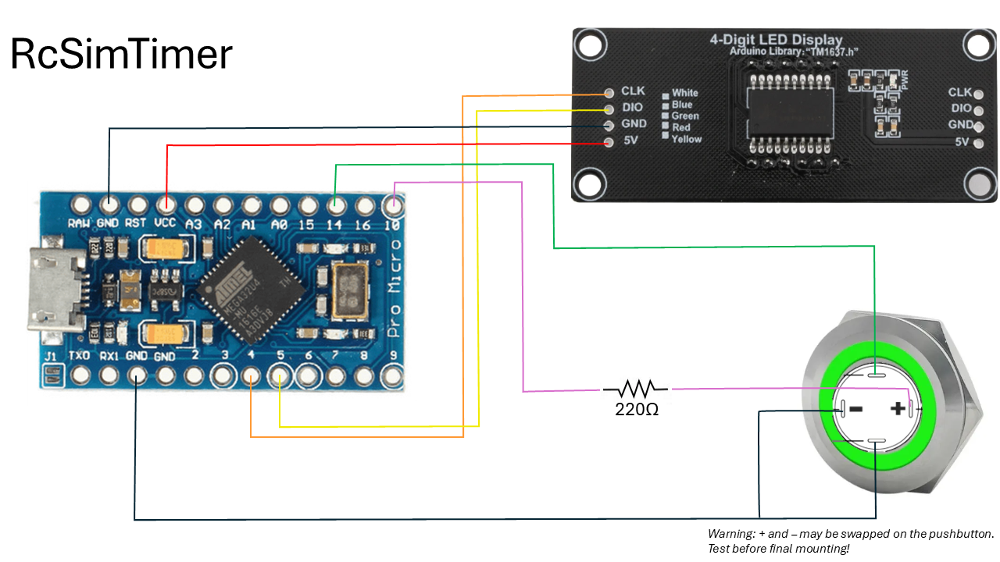

rc-sim-timer
===
Project to manage RC Flight Simulators via an Arduino-based push button UI.

Currently supported RC FLight Simulators:

* Phoenix v4
* RealFlight Basic
* RealFlight v9

    Note: This project uses git submodules.

    To clone this project use these commands:

    * git clone https://github.com/andbrandt/rc-sim-timer
    * cd rc-sim-timer
    * git submodule init
    * git submodule update

---
# Features:

* Pushbutton to reset simulation when plane gets too far away - or crashes
* Countdown on 7 segment display to show remaining time
* Flashing of 7 segment display when time is running out
* Cool-down period (8 seconds) to nudge current user to hand over controller to next person
* Long-press to select actual RC Simulator and simulation time of 2, 5 or 10 minutes
* Double-press to toggle between EASY and ACRO models

---
# How to start up system:

1. Start up Windows and log in
2. Connect USB RC controller to the front port of the sim-timer box
3. Connect the sim-timer box cable

---
# User Interface:

## Push button
* <b>Light in button</b>: Simulation ready to run - or running. 
* <b>Short-press</b>: Reset simulation
* <b>Double-press</b>: Toggle between EASY and ACRO models
* <b>Long-press</b>:  Enter Setup menu to select RC Simulator and simulation time.
  * Short-press while in Setup: Toggle selection
  * Long-press while in Setup: Accept current selection; then step to next setting or exit setup
* <b>Press during power-op</b>: SAFE MODE:
USB Keyboard/mouse inactivated to not interfere with firmware update

## 7-segment display
* Shows remaining simulation time
* In Setup menu, the display steps through options to be selected

---
# Simulator preparation
Depending on your simulator, you may have to do a litte setup to make it work with rc-sim-timer.
## Phoenix v4

Define two airplane favorites in the aircraft setup menu. Let the first (uppermost) be an electric high-wing beginner model and the second be an aerobatic model.

rc-sim-timer starts up the simulator when the USB plug is inserted.

TODO: Update code to select desired airport when starting.

TODO: Update code to select desired airplanes for easy and acro without requiring sim setup.

rc-sim-timer will choose an airplane from this list when you toggle between models using double press.
## RealFlight Basic

No preparations needed.

rc-sim-timer restores default settings and starts up the simulator when the USB plug is inserted.

## RealFlight v9

No preparations needed.

rc-sim-timer selects the same airport as in RealFlight Basic and starts up the simulator when the USB plug is inserted.

# Building the mechanics

---
Bill of Material (BOM):

* Laser cut 6mm plywood components for enclosure (Link to design & files)
* 3D printed UI panel (Link to design & files)
* Arduino Pro Micro
* Push button with built-in light for UI effects (TODO: Link)
* 4-digit 7-segment I2C display
* Micro USB hub PCB (TODO: Link)
* Female USB connector

## Mounting electronics in the 3D printed UI panel.

Start gluing the push button, arduino and USB connector into the recesses of the front panel. Push the two mounting rods sideways in to lock the USB connector into position.

TODO

TODO

TODO

---
**WARNING #1**

When connecting the Arduino Pro Micro, it may show up as "Arduino Leonardo" or "LilyPad Arduino USB".

**DO NOT** change the board type in the Arduino IDE. You may brick the device (in a soft way),requiring you to reset the bootloader by double-resetting and loading an empty sketch to the device. 

**WARNING #2**

The push button (two individual items) used in this project was found to have + and - swapped...

